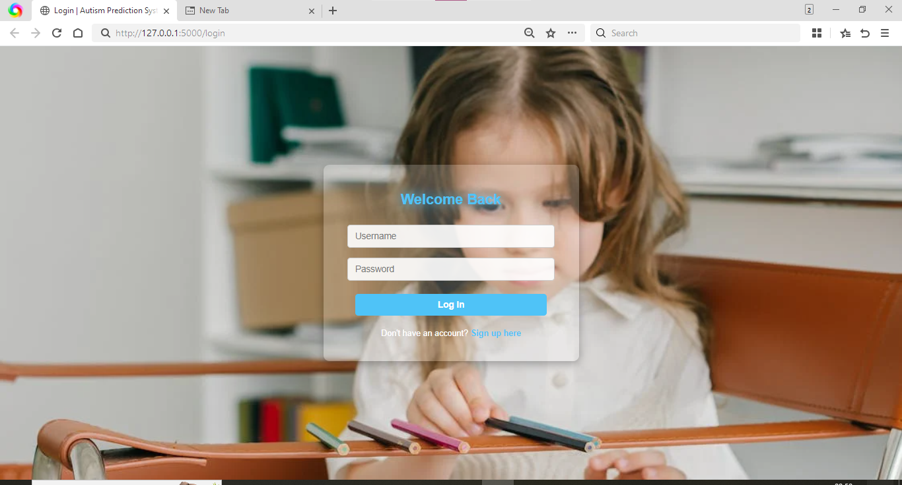
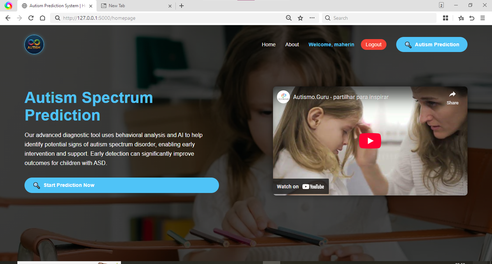
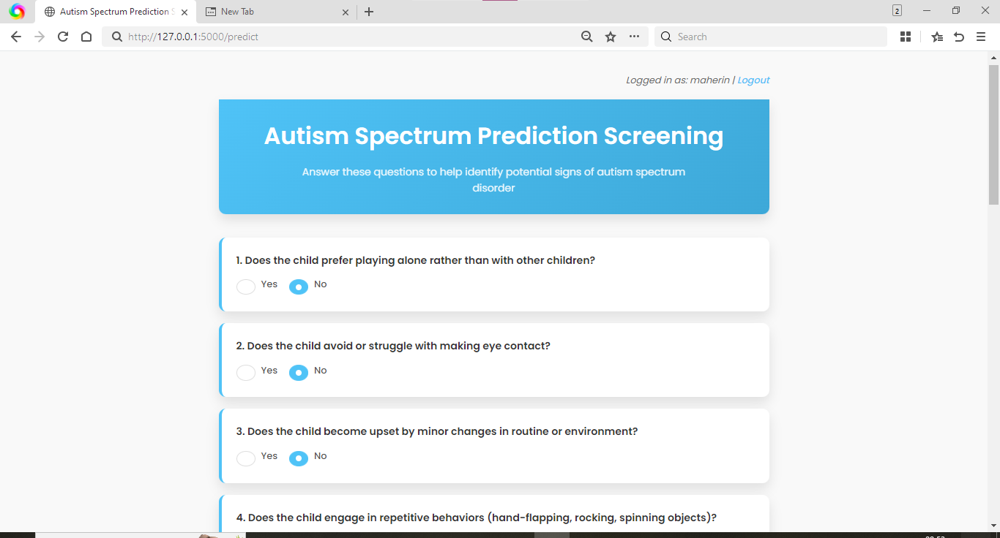
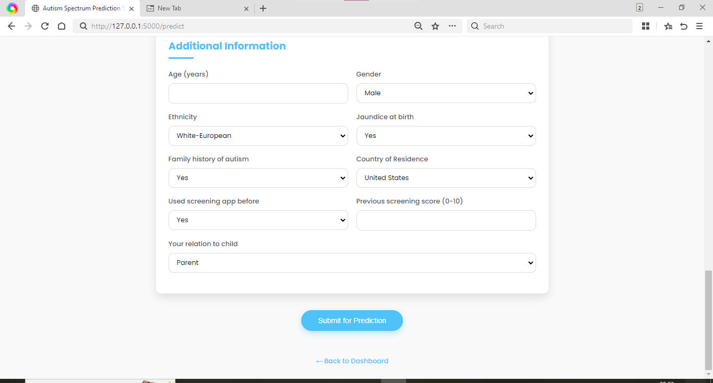
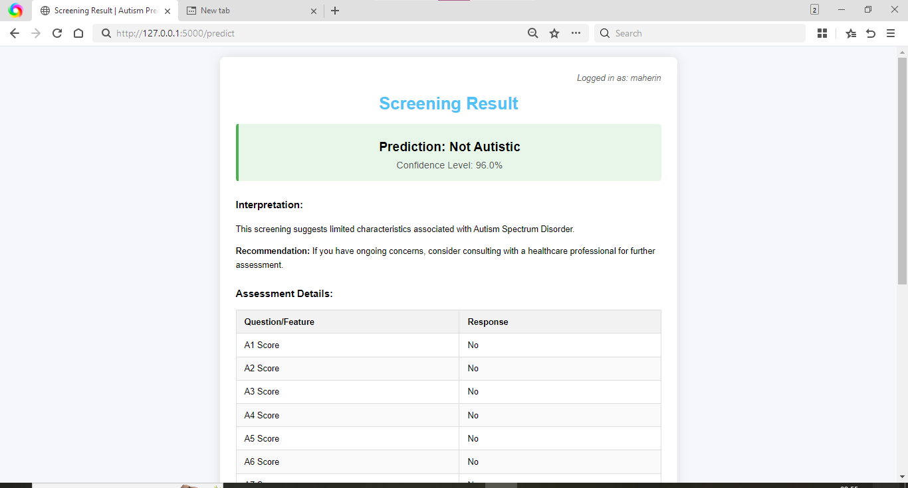

# 🧠 Autism Prediction System using Machine Learning

This is a Flask-based machine learning web application that predicts the likelihood of Autism Spectrum Disorder (ASD) in individuals based on questionnaire inputs and behavioral attributes. The best-performing model is deployed for real-time prediction.

## 📌 Table of Contents

- [About the Project](#about-the-project)
- [Tech Stack](#tech-stack)
- [Features](#features)
- [Machine Learning Models Used](#machine-learning-models-used)
- [Project Structure](#project-structure)
- [How to Run Locally](#how-to-run-locally)
- [Screenshots & UML Diagrams](#screenshots--uml-diagrams)
- [Team](#team)
- [License](#license)

---

## 📖 About the Project

This project aims to help in the early detection of Autism Spectrum Disorder using machine learning. It provides a user-friendly web interface for submitting questionnaire data and instantly receives predictive results based on a trained classifier.

The dataset was collected from Kaggle and cleaned using preprocessing techniques. The final model was selected using RandomizedSearchCV with performance metrics such as Accuracy, Precision, Recall, and F1 Score.

---

## 🧰 Tech Stack

- **Python 3**
- **Flask** – Web framework
- **scikit-learn** – ML modeling and preprocessing
- **XGBoost** – Gradient boosting classifier
- **Pandas & NumPy** – Data manipulation
- **SMOTE** – Handling class imbalance
- **HTML/CSS** – Frontend design
- **GitHub Desktop** – Version control

---

## 🌟 Features

- Interactive web interface using Flask
- Data preprocessing with encoding, scaling, and SMOTE
- Model training with Decision Tree, Random Forest, and XGBoost
- Hyperparameter tuning using RandomizedSearchCV
- Real-time autism prediction based on user input
- UML diagrams included for software documentation

---

## 📊 Machine Learning Models Used

- **Decision Tree Classifier**
- **Random Forest Classifier** (Selected as best)
- **XGBoost Classifier**

Each model was evaluated using Accuracy, Precision, Recall, and F1 Score. The Random Forest model gave the best balance of performance.

---

## 📁 Project Structure

📦 autism-prediction-system ├── app.py ├── templates/ │ ├── home.html │ ├── prediction.html │ └── result.html ├── models/ │ ├── best_model.pkl │ └── encoder.pkl ├── static/ │ └── (if any images or CSS used) ├── diagrams/ │ ├── class.png │ ├── sequence.png │ ├── structure.png │ ├── component.png │ └── deployment.png ├── requirements.txt └── README.md


---

## 💻 How to Run Locally

```bash
git clone https://github.com/Maherin-shaik/autism-prediction-system.git
cd autism-prediction-system
pip install -r requirements.txt
python app.py
```


Then open http://127.0.0.1:5000/ in your browser to use the app.

## 📷 Screenshots & UML Diagrams
🎨 UI Screens

### Lohin Page


### 🏠 Home Page


### 📝 Prediction Form



### 📊 Result Page



## 📊 UML Diagrams

### Class Diagram


### Sequence Diagram


### Component Diagram


### Deployment Diagram


### Structure


Name : Lalitha Sri
📄 License
This project is for academic and learning purposes only.

---

## 📈 Model Comparison (Same Test Split)

The app now supports **two models**:
- Random Forest (Best Model)
- AdaBoost

You can compare them directly in:
- `Performance` page → **RF vs AdaBoost (Same Test Split)** table

For presentation/report, include:
- Accuracy
- Precision (Autistic = class 1)
- Recall (Autistic = class 1)
- F1 (Autistic = class 1)

---

## ⚠️ Project Limitations

- This is a **screening** tool, not a clinical diagnostic system.
- Model quality depends on training data quality and representativeness.
- Dataset may not capture all demographic/clinical variations.
- Self-reported questionnaire responses can introduce bias.
- Prediction confidence is model confidence, not medical certainty.

---

## 🚀 Future Work

- Add external/clinical dataset validation.
- Add explainability (e.g., SHAP/LIME feature explanations).
- Include calibration and threshold tuning workflows.
- Add role-based access and secure password hashing.
- Add automated test suite and CI checks.
- Add multilingual UI and accessibility improvements.

---

## 🌍 Deployment Link and Screenshots

Public deployment (Render/Railway):
- **Live URL:** `PASTE_YOUR_DEPLOYED_LINK_HERE`

Suggested screenshots to include in final report:
- Login page
- Home page
- Prediction form with model selection
- Result page (YES/NO + scores)
- Performance page (comparison table + confusion matrix)
- Chart page
- Generated PDF report

---

## 🧪 Manual Test Scenarios (10)

1. Valid signup + login should redirect to homepage.
2. Invalid login should show error.
3. Access `/predict` without login should redirect to login.
4. Submit prediction with Random Forest; result should render with YES/NO.
5. Submit prediction with AdaBoost; result should render and show selected model.
6. `Performance` page should show class-wise metrics and RF vs AdaBoost table.
7. `Chart` page should render distribution + feature importance chart.
8. Download PDF should return a valid `.pdf` file with full report contents.
9. Logout should clear session and block protected routes.
10. Unknown categorical values should be safely handled (fallback encoding, no crash).

---

## 🧭 Ethics and Disclaimer

- This application is intended for **educational and screening assistance only**.
- It must **not** be used as a substitute for professional diagnosis.
- Final medical judgment should be made only by qualified healthcare professionals.
- Predictions should be interpreted responsibly, avoiding stigma and discrimination.
